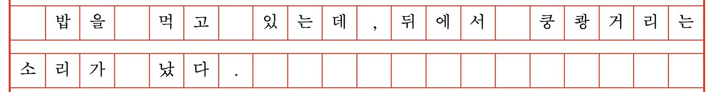
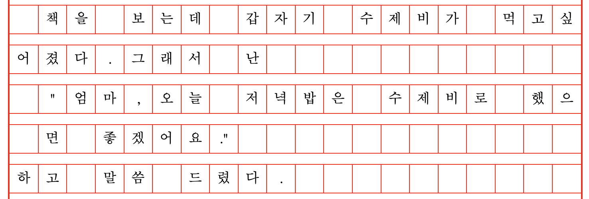
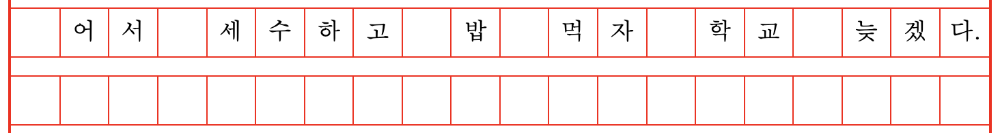
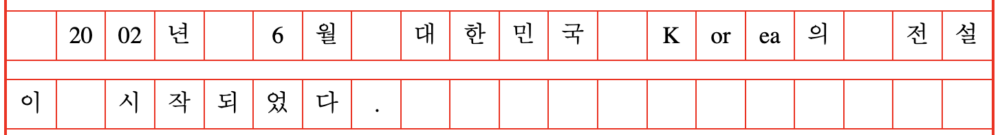
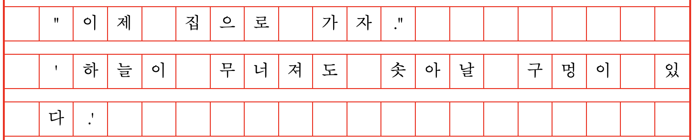

# Wongoji

원고지 작성 관련 유틸리티 모음

## Packages

다음과 같은 유틸리티를 제공하고 있습니다. 각 패키지에 대한 설명은 패키지 디렉토리에 있는 설명을 참조하세요.

- [@wongoji/core](./packages/core/README.md): 다른 원고지 패키지에서 사용할 공통 함수를 제공합니다.
- [@wongoji/counter](./packages/counter/README.md): 주어진 텍스트가 원고지 몇 매가 되는지 정확하게 계산합니다.

## 규칙

이 패키지에서 적용하는 원고지 작성법 및 규칙은 다음과 같습니다. 원고지 작성 규칙과 테스트 문장은 EBS 독서력진단센터의 [원고지 쓰는법](https://www.ebsreadingtest.co.kr/eduData/reading/reading_page01_05.asp)을 대체로 따릅니다.

1. 전달된 모든 텍스트를 산문의 본문으로 가정하고 계산합니다.
1. 두 번 이상의 줄바꿈은 줄바꿈 한 번으로만 계산합니다.
1. 문단을 시작하는 첫 줄의 첫 칸은 비우고 시작합니다.
1. 띄어쓰기를 첫 칸에 표기해야 하는 경우에는 띄어쓰기 공백을 표시하지 않습니다. 문단이 바뀔 때만 첫 칸을 비웁니다.  
  
1. 큰 따옴표나 작은 따옴표로 시작한 문장은 따옴표가 끝날 때까지 왼쪽 첫 칸을 모두 비웁니다.
1. 말의 중간에 큰 따옴표가 있을 때에는 줄을 바꾸어 씁니다.(작은 따옴표는 줄을 바꾸지 않습니다)  
   
1. 왼쪽 첫 칸이 온점(마침표) 혹은 반점(쉼표)이 되는 경우에는 온점과 반점을 앞 줄 마지막 칸에 같이 씁니다.  
  
1. 숫자와 영어 소문자는 한 칸에 두 자씩 작성하되 영어 대문자는 한 칸에 한 자씩 작성한다.  
  
1. 온점 바로 뒤에 닫는 따옴표가 올 경우, 온점과 따옴표 기호를 한 칸에 씁니다.  
  
